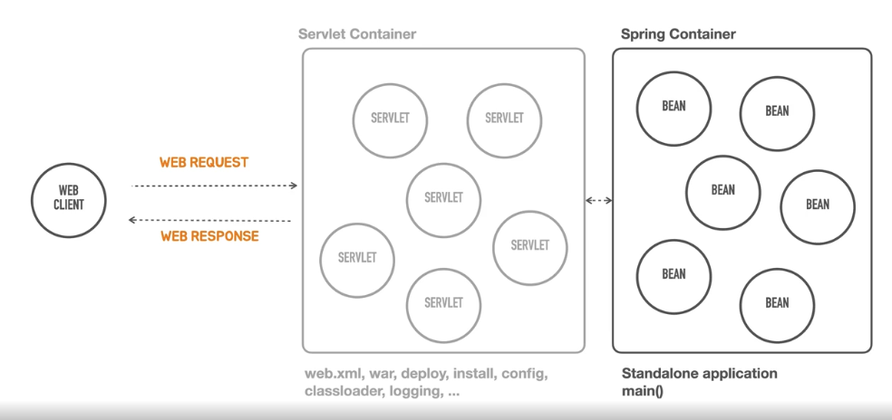

# 스프링 부트 소개

- **스프링 기반**의 **독립 실행형** 애플리케이션을 실무 환경에 사용 가능한 수준으로
- **복잡한 고민 없이 빠르게** 작성할 수 있게 도와주는
- 여러가지 도구의 모음(라이브러리, 프레임워크 등)이다.

# 스프링 부트의 핵심 목표

- 매우 빠르고 광범위한 영역의 스프링 개발 경험 제공
- 강한 주장을 가지고 즉시 적용 가한 기술 조합을 제공하면서, 필요에 따라 원하는 방식으로 손쉽게 변형 가능
- 프로젝트에서 필요로 하는 다양한 비기능적인 기술(내장형 서버, 보안, 메트릭, 상태 체크, 외부 설정 방식 등) 제공
- 코드 생성이나 XML 설정을 필요로 하지 않음

# 스프링 부트의 역사

새로운 요구사항 등장으로 스프링 부트라는 새로운 프로젝트를 시작하게 됨.

- Containerless 웹 개발 아키텍처 지원 요청
- 복잡한 설정 없이 간편하게 개발 시작

# Containerless (Serverless)

## 일반적인 웹 프로그래밍 개발

웹 컴포넌트(Servlet)와 웹 클라이언트
- 동적인 컨텐츠를 만드는 웹 컴포넌트를 여러개 개발한다. 
- 웹 컴포넌트는 웹 클라이언트의 요청에 따라 컨텐츠를 생성하고 응답한다. 
- 웹 컴포넌트는 항상 웹 컨테이너 안에서 동작한다.

**웹 컨테이너** (ServletContainer - Tomcat 등..)
- 웹 컨테이너는 웹 컴포넌트의 라이프 사이클을 관리한다. 컴포넌트를 메모리에 올리고 내리는 등의 작업을 한다.
- 웹 컨테이너는 요청을 어떤 컴포넌트에 넘겨줄지 결정하는 라우팅(매핑) 작업을 한다.

스프링 컨테이너
- 서블릿 컨테이너 뒤에 위치. 
- 스프링 빈으로 등록된 여러 빈들을 관리한다.
- 서블릿을 통해 들어온 요청을 특정 빈이 처리하도록 라우팅한다.

컨테이너 구조의 복잡성
- 스프링 컨테이너를 띄우려면 서블릿 컨테이너가 반드시 떠있어야 한다.
- 문제는 서블릿 컨테이너 설정이 복잡하고, WAR 빌드를 위해 폴더 구성도 해야하고, 톰캣 서버를 설치해서 서블릿을 배포해야 한다.
- 어떤 서블릿 컨테이너를 선택하느냐에 따라 배포 방식이나 설정이 다르다. 이 작업은 초기에 한번 이루어지므로 높은 러닝 커브 대비 효용성이 없다.
- 스프링 컨테이너에 집중하기 어렵다.

**Containerless** 
- 서블릿 컨테이너가 여전히 동작하지만, 개발자가 서블릿 컨테이너 설정과 구축에 들이는 비용을 제거하는 것이 목표이다.
- 스프링 부트는 서블릿 컨테이너가 뜨기 위해 필요한 설정이나 설치 등의 작업을 기본값으로 제공한다.
- 그래서 개발자는 애플리케이션에서 어떤 빈이 필요한지에만 집중할 수 있다.
- 스프링 부트에서 main을 실행하면 서블릿 컨테이너 시작까지 자동화되어 서버 동작에 필요한 모든 작업이 수행된다.

# Opinionated (주장이 강한)

스프링이 제공하는 많은 선택지 중 내가 사용할 것을 결정해야만 스프링 애플리케이션을 만들 수 있었다.
스프링 부트는 고민 없이 빠르게 시작할 수 있도록 지원한다.

스프링 프레임워크의 설계 철학
- 극단적인 유연함 추구
- 다양한 관점 추구(aop)
- not opinionated
- 수많은 선택지를 포용

스프링 부트의 설계 철학
- Opinionated : 자기 주장이 강한, 자기 의견을 고집하는, 독선적인
- 일단 정해주는 대로 빠르게 개발하고 고민은 나중에
- 스프링을 잘 활용하는 뛰어난 방법을 제공

스프링 부트가 결정해주는 것
- 사용할 기술과 의존 라이브러리를 결정함
- 업계에서 검증된 스프링 생태계 프로젝트, 표준 자바 기술, 오픈소스 기술의 종류와 의존관계, 사용 버전을 정해줌
- 각 기술을 스프링에 적용하는 방식(DI)과 디폴트 설정값 제공

스프링 부트의 유연한 확장
- 스프링 부트에 내장된 디폴트 구성을 커스토마이징하는 매우 자연스럽고 유연한 방법을 제공함
- 스프링 부트가 스프링을 사용하는 방식을 이해한다면 언제라도 스프링 부트를 제거하고 원하는 방식으로 재구성 가능
- 스프링 부트처럼 기술과 구성을 간편하게 제공하는 나만의 모듈 작성 가능

# 스프링 부트의 이해

스프링 부트를 이해하게 되면
- 스프링 부트가 스프링의 기술을 어떻게 활용하는지 배우고 응용할 수 있다
- 스프링 부트가 선택한 기술, 자동으로 만들어주는 구성, 디폴트 설정이 어떤 것인지 확인한다
- 필요할 때 부트의 기본 구성을 수정하거나 확장할 수 있다
- 나만의 스프링 모듈을 만들어 활용할 수 있다

