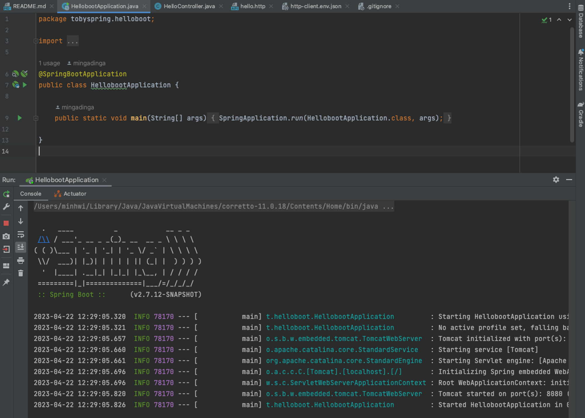
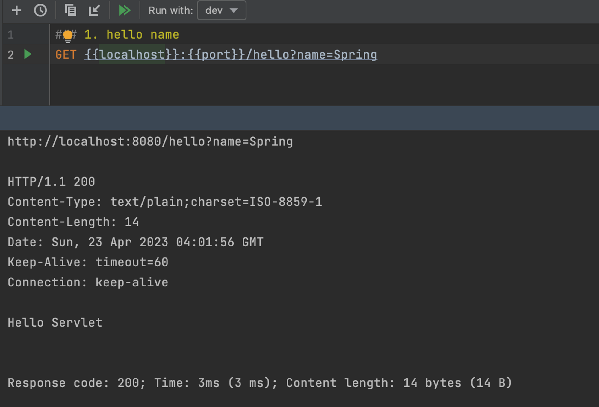

# Containerless

컨테이너리스를 지향한다는 것은 서블릿 컨테이너와 관련된 복잡한 설정과 지식을 몰라도 배포를 할 수 있다는 말이다. 개발자는 스프링 컨테이너에 올라가는 빈의 개발만 신경쓰면 된다. Standalone으로 main 메소드를 동작하는 방식으로 스프링 애플리케이션을 동작시킬 수 있다.



이 main 메소드를 실행하는 것만으로 컨테이너와 관련된 작업, 스프링이 구동되는데 필요한 모든 작업이 수행되었다. 우리가 작성한 컨트롤러가 컨테이너에 빈으로 등록되는 것까지 완료되었다. 개발자는 정말 컨테이너에 올라가는 애플리케이션 빈만 신경써주면 되는 것이다.

이렇게 컨테이너가 없는 것처럼 개발하는 방법을 Containerless라고 한다. (실제로는 컨테이너가 존재하는데 스프링 부트가 관련 작업을 다 해줘서 개발자가 신경쓸 필요가 없는 것이다) 이 섹션에서는 스프링 부트의 도움 없이 standalone으로 동작하도록 만들어본다.

그래서 서블릿 컨테이너 대신 standalone 프로그램에서 서블릿 컨테이너를 띄워주도록 만들고, 서블릿 컨테이너를 신경쓰지 않도록 만들어보는 작업을 한다.

# 서블릿 컨테이너 띄우기

빈 서블릿 컨테이너를 하나 띄워보자. 톰캣을 설치 없이 main 메소드로 한번 띄워보자.

톰캣도 자바로 만들어진 프로그램이다. 톰캣은 서버 머신에서 돌아가도록 만들어진 자바 웹 서버 프로그램인데, 그중 내장 톰캣은 웹 애플리케이션이 코드 내부에 톰캣을 포함시켜 사용하는 것을 말한다. 사용자가 톰캣 서버를 별도로 설치하거나 설정할 필요 없이 간단한 명령어를 통해 웹 애플리케이션을 실행할 수 있다. 스프링 부트도 내장 톰캣을 사용한다. 만약 스프링 이니셜라이저로 스프링부트 프로젝트를 만들었다면 내장 톰캣이 이미 포함된다.

```java
public class HellobootApplication {

	public static void main(String[] args) {
		ServletWebServerFactory serverFactory = new TomcatServletWebServerFactory();
		WebServer webServer = serverFactory.getWebServer();
		webServer.start();
	}

}
```

스프링 부트가 톰캣 서블릿 컨테이너를 내장해서 쉽게 구동할 수 있도록 도와주는 도우미 클래스를 사용했다. 원래 new Tomcat().start()로 스프링 부트의 도움 없이 내장 톰캣을 실행할 수 있는데, 설정해줘야하는 정보가 많아서 스프링 부트의 도움을 받아 내장 톰캣을 간단하게 띄웠다. 스프링 부트는 웹 서버 종류를 추상화하는 타입을 지원한다. 위에서는 톰캣을 사용했지만, 제티나 엔진엑스 등 다른 웹 서버를 사용하고 싶다면 의존성을 변경해주면 된다.

```java
public class HellobootApplication {

	public static void main(String[] args) {
		ServletWebServerFactory serverFactory = new JettyServletWebServerFactory();
		WebServer webServer = serverFactory.getWebServer();
		webServer.start();
	}

}
```

# 서블릿 등록

서블릿 컨테이너 안에 들어가는 웹 컴포넌트인 서블릿을 만들어 등록해보자. 서블릿 컨테이너는 클라이언트의 요청(http)을 받아 매핑 과정을 받아 요청을 처리할 서블릿을 결정한다. 서블릿이 웹 응답을 만들기 위해 필요한 작업을 수행하면 서블릿 컨테이너가 http 응답을 만들어 클라이언트에 반환한다.


```java
public class HellobootApplication {

	public static void main(String[] args) {
		ServletWebServerFactory serverFactory = new TomcatServletWebServerFactory();
		WebServer webServer = serverFactory.getWebServer(servletContext -> {
			servletContext.addServlet("hello", new HttpServlet() {
				@Override
				protected void service(HttpServletRequest req, HttpServletResponse resp) throws ServletException, IOException {
					resp.setStatus(200);
					resp.setHeader("Content-Type", "text/plain");
					resp.getWriter().println("Hello Servlet"); // body
				}
			}).addMapping("/hello"); // mapping
		});

		webServer.start();
	}

}
```

위 코드는 /hello URL로 요청이 들어오면 hello 이름을 가진 서블릿이 매핑되어 처리한다. hello 서블릿에서는 응답코드를 200, 헤더 컨텐트 타입은 plain text, 메시지 바디에는 “Hello Servlet”을 작성하여 응답을 만들도록 정의한다. 실제로 서블릿에서 정의한대로 http 응답을 만드는 작업은 서블릿 컨텍스트가 한다.

main으로 톰캣을 띄우고 /hello 로 요청을 보내보면 Hello Servlet이 메시지 바디로 오는 것을 볼 수 있다.



# 서블릿 요청 처리

응답을 만드는 부분에 하드코딩한 문자열을 스프링이 제공하는 상수로 변경했고, 파라미터 변수 name을 받아 동적으로 메시지 바디를 작성했다.

```java
public class HellobootApplication {

	public static void main(String[] args) {
		ServletWebServerFactory serverFactory = new TomcatServletWebServerFactory();
		WebServer webServer = serverFactory.getWebServer(servletContext -> {
			servletContext.addServlet("hello", new HttpServlet() {

				@Override
				protected void service(HttpServletRequest req, HttpServletResponse resp) throws ServletException, IOException {

					// url parameter 받아서 동적으로 응답 생성하기
					String name = req.getParameter("name");

					// 응답 생성 개선 : 하드코딩한 문자열 -> 스프링이 제공하는 상수
					resp.setStatus(HttpStatus.OK.value());
					resp.setHeader(HttpHeaders.CONTENT_TYPE, MediaType.TEXT_PLAIN_VALUE);
					resp.getWriter().println("Hello " + name); // body
				}
			}).addMapping("/hello"); // mapping
		});

		webServer.start();
	}

}
```

# 프론트 컨트롤러

위에서 작성한 서블릿의 개수가 백개로 늘어난다고 생각해보자. 서블릿이 실제 처리하는 로직은 조금씩 달라지지만 요청을 받거나 응답을 만드는 부분은 비슷한 코드들이 반복될 것이다. 그리고 모든 서블릿이 공통으로 처리해야하는 인증, 보안, 다국어 처리 등의 동일한 로직이 반복될 것이다. 서블릿이 중복되는 코드들을 가지지 않도록, 중복된 코드를 Front Controller에게 할당하고 이 프론트 컨트롤러에서 url을 매핑하여 서블릿에게 개별 로직을 처리하도록 요청한다. 이때 서블릿은 중복되는 코드를 가지지 않고 응답에 필요한 로직만 가진다.


FrontController 서블릿을 등록해보자. 이름을 frontcontroller로 변경했고, 중앙 처리를 해야하므로 모든 url의 요청을 frontcontroller로 들어오도록 만들었다.

```java
public class HellobootApplication {

	public static void main(String[] args) {
		ServletWebServerFactory serverFactory = new TomcatServletWebServerFactory();
		WebServer webServer = serverFactory.getWebServer(servletContext -> {
			servletContext.addServlet("frontcontroller", new HttpServlet() {

				@Override
				protected void service(HttpServletRequest req, HttpServletResponse resp) throws ServletException, IOException {

					// 서블릿의 공통 기능 처리...

					// mapping
					if (req.getRequestURI().equals("/hello") && req.getMethod().equals(HttpMethod.GET.name())) {
						String name = req.getParameter("name");
						resp.setStatus(HttpStatus.OK.value());
						resp.setHeader(HttpHeaders.CONTENT_TYPE, MediaType.TEXT_PLAIN_VALUE);
						resp.getWriter().println("Hello " + name); // body
					}
					else if (req.getRequestURI().equals("/user")) {
						//
					}
					else {
						resp.setStatus(HttpStatus.NOT_FOUND.value());
					}

				}
			}).addMapping("/*"); // 중앙 처리
		});

		webServer.start();
	}

}
```

이 코드에서 url과 method를 매핑하여 hello name을 동적으로 반환하는 응답을 만들었다. 그런데 보통 frontcontroller에서는 매핑까지만 담당하고, 실제 실행되는 서블릿은 요청을 통해 응답을 만든다. (클래스는 적은 책임을 가져야한다) 이 부분을 분리해보자.

# Hello 컨트롤러 매핑과 바인딩

전에 만들어두었던 HelloController에서 스프링 부트와 관련된 애노테이션을 제거하여 순수한 자바 객체로 만든다. 이 객체는 매개변수로 받은 name에 Hello를 붙여 동적인 문자열을 만드는 책임을 가진다. 프론트 컨트롤러에서 /hello로 매핑되는 서블릿이 실제로 할 일을 여기에서 담당한다.

```java
public class HelloController {
    public String hello(String name) {
        return "Hello " + name;
    }
}
```

이제 프론트 컨트롤러에서 /hello get으로 들어온 요청을 HelloController에게 위임하도록 하자. 프론트 컨트롤러에서 http 요청 정보를 담은 req에서 name을 추출하여 HelloController에게 메시지로 전달한다. HelloController에서 만든 동적인 문자열을 ret에 담아 http 응답인 resp에 담는다. 이렇게 보면 프론트 컨트롤러는 http 요청에서 값을 추출하여 서블릿 객체에게 메시지를 호출할 때 함께 넘겨주고, 서블릿이 만든 결과물을 http에 담는다. 마지막으로 서블릿 컨테이너가 이 http 응답을 웹 클라이언트에게 넘겨줄 것이다. 여기서 핵심은 http 요청 응답과 관련된 코드와 서블릿이 실행해야하는 핵심 코드를 객체로 분리했다는 것이다. 이것을 바인딩이라고 한다. (사실 객체지향의 관점에서 보면 너무 당연한 것)

```java
public class HellobootApplication {

	public static void main(String[] args) {
		ServletWebServerFactory serverFactory = new TomcatServletWebServerFactory();
		WebServer webServer = serverFactory.getWebServer(servletContext -> {

			HelloController helloController = new HelloController();

			servletContext.addServlet("frontcontroller", new HttpServlet() {

				@Override
				protected void service(HttpServletRequest req, HttpServletResponse resp) throws ServletException, IOException {

					// 서블릿의 공통 기능 처리...

					// mapping
					if (req.getRequestURI().equals("/hello") && req.getMethod().equals(HttpMethod.GET.name())) {
						// req
						String name = req.getParameter("name");

						// binding - 요청, 응답을 만드는 코드와 컴포넌트 처리 코드를 분리
						// 프론트 컨트롤러 - 요청 객체에서 컴포넌트가 사용하는 타입으로 전환, 응답 만들기
						String ret = helloController.hello(name);

						// resp
						resp.setStatus(HttpStatus.OK.value());
						resp.setHeader(HttpHeaders.CONTENT_TYPE, MediaType.TEXT_PLAIN_VALUE);
						resp.getWriter().println(ret);
					}
					else if (req.getRequestURI().equals("/user")) {
						//
					}
					else {
						resp.setStatus(HttpStatus.NOT_FOUND.value());
					}

				}
			}).addMapping("/*"); // 중앙 처리
		});

		webServer.start();
	}

}
```